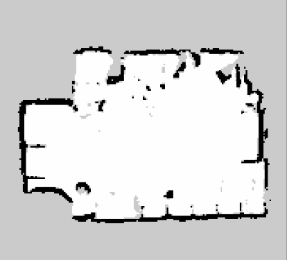
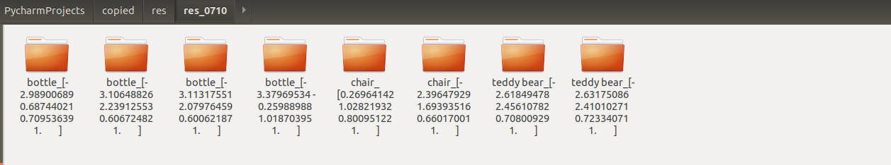
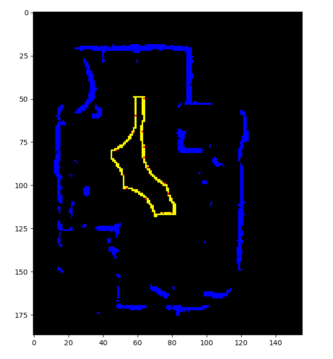
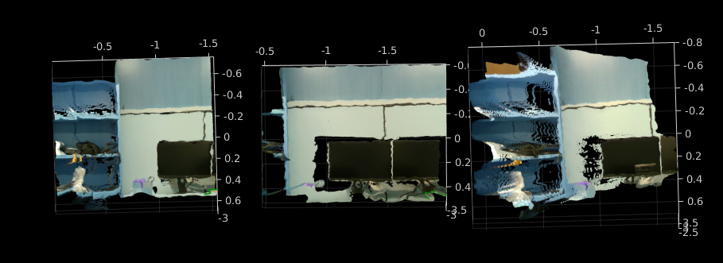
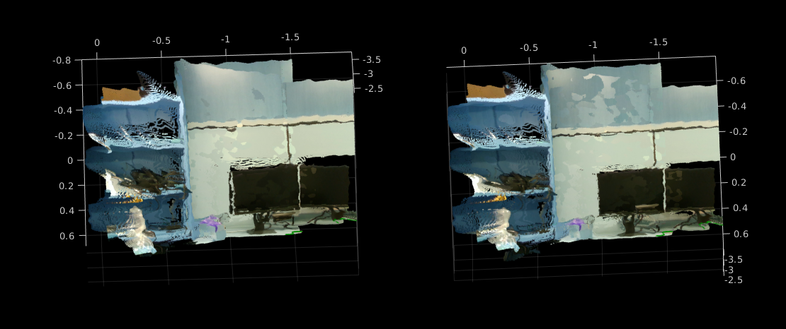
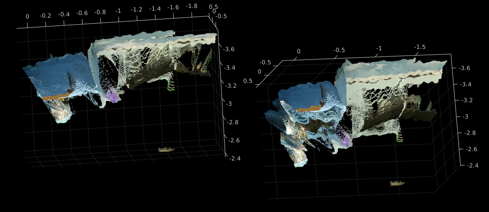
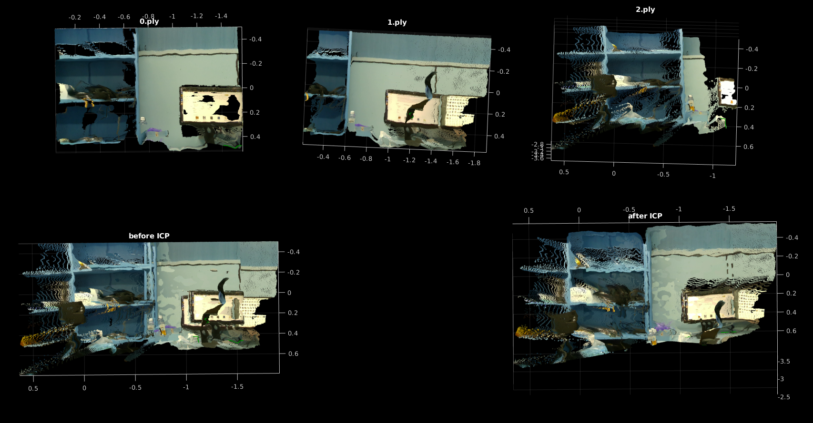

# 3D scene graph generation

A robot(Turtlebot3) moves around in an indoor environment and captures 3D point cloud of wanted_objects.   
Point clouds are processed by camera calibration and icp_registration to make complete 3D data. 
ROS2(navigation/registration), Detectron2(object detection), Pyrealsense(capturing), Open3D(registration) are combined to implement each functional module. 

input : 2D slam map

output : 3D point cloud(global coordinate tagged)

 

## Prerequisites
- ROS2 : dashing  
- Ubuntu : 18.04  
- detectron2 : 0.1.1  
- pyrealsense2 : 2.34.0.1454  
- open3D : 0.9.0.0  
- python : 3.6.10 

 ## Process
  1. Extract global path & navigation goals(red : navigation_goals, yellow : path)
  
  
  2. Navigate to global path
  
  3. Extract local navigation goals 
    3.1. Navigate to local goals 
    3.2. Capture 3D point cloud 
    3.3. Repeat
  
  4. Registration 
    - The robot odometry is obtained by ROS2 topic message '/amcl_pose'.
    With camera calibration combined, we can calculate the transformations needed for rough registration. 
    - After rough registrations, ICP registration is applied to refine the data.
  
  5. Return to step 2  
  
 Youtube link :  
 
 
 ## Result(3D data made)
 The result 3D data are made in 'res' folder. Each object is saved with its name & global homogenious coordinates.
 
 
  ### TV
 - before registration
 
 
 - after registration

 
 filename : tv_[-3.29162005  1.05766124  0.84587418  1.        ].ply  
 left : before icp_registration  
 right : after icp_registration(Point-to-point)
 
 Seen from above, left image is a little inaccurate. Since Detectron2 percepts a monitor as tv, we typed 'tv' as a wanted category.

 ### Teddy bear
filename : teddy bear_[-2.61849478  2.45610782  0.70800929  1.        ].ply

- front view

- above view

 
 ### Bottle
 filename : bottle_[-2.98900689  0.68744021  0.70953639  1.        ].ply
 - front view
 
 
 - above view
 
 
 - problems : 
  1. too many unnecessary objects included. This might cause inaccurate registration.
  
  2. If the fluid in bottle is transparent, point cloud might not be made at that point.
  
 
 ## Further research
  
  1. object segmentation & crop. It would need an object_segmentation network. 
   > * JSIS3D(CVPR 2019, PointNet based model) is applied directly. Please refer to my [Github](https://github.com/djflstkddk/jsis3d).
   > * Further research should include applying network based on voxelization & sparse convolutions.
  
  2. Save each 3D point cloud as a latent vector to use in 3D scene graph. Raw point cloud is too big to use. 
  It would need an encoder & decoder pair. 
   
 
 
 
 
updating....
 
 
 
 
 
 
 
